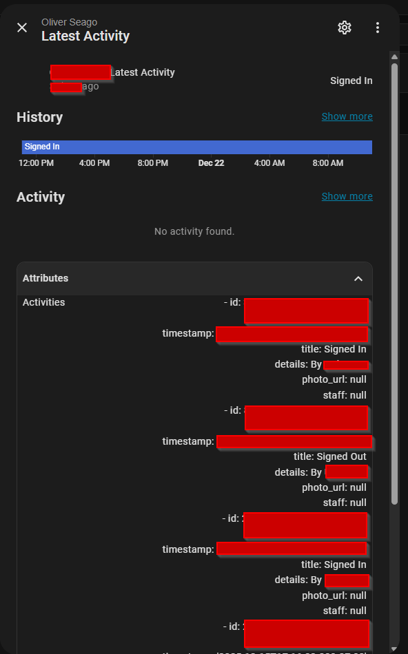

# Procare Activities Integration for Home Assistant

This is a custom integration for Home Assistant to display the latest activities from the [Procare Connect](https://procareconnect.com/) platform. It creates a sensor that shows the most recent activity for a selected child and stores all of today's activities in the sensor's attributes.

## Features

*   **Fetches Daily Activities:** Retrieves the latest activities for a selected child from the Procare Connect API.
*   **Real-time Sensor:** Creates a sensor entity in Home Assistant for the most recent activity. The sensor's state is the title of the latest activity (e.g., "Meal: Lunch").
*   **Detailed Attributes:** Stores all activities from the last 7 days in the sensor's attributes, including timestamps, details, photos, and staff member names.
*   **Multi-child Support:** If your account has multiple children, you can select which child to monitor during the configuration process.
*   **Custom School Support:** Supports Procare instances with custom school domains.

## Installation

### HACS (Recommended)

1.  Add this repository as a custom repository in HACS:
    *   Go to HACS > Integrations > ... (three dots in the top right).
    *   Select "Custom repositories".
    *   Paste the URL to this repository (`https://github.com/nmanclank/ha-procare-activities`) in the "Repository" field.
    *   Select "Integration" as the category.
    *   Click "Add".
2.  Search for "Procare Activities" and install it.
3.  Restart Home Assistant.

### Manual Installation

1.  Copy the `procare_activities` directory from this repository into your Home Assistant `custom_components` folder.
2.  Restart Home Assistant.

## Configuration

1.  Go to **Settings > Devices & Services**.
2.  Click **Add Integration** and search for **Procare Activities**.

    

3.  Enter your Procare Connect username and password.
4.  **(Optional)** If your school uses a custom Procare domain (e.g., `myschool.procareconnect.com`), enter the school's unique name (e.g., `myschool`) in the "School Name" field. If you leave this blank, the integration will use the default Procare URLs.

    

5.  If you have more than one child associated with your account, you will be prompted to select one from a list.

    

6.  A new sensor will be created for the selected child.

## Sensor Usage

The integration creates a sensor named `sensor.<child_name>_activities`.

*   **State:** The state of the sensor will be the title of the most recent activity (e.g., "Nap Started at 1:00 PM").
*   **Attributes:** The sensor's attributes contain a list of all activities from the past 7 days. Each activity is a dictionary with the following keys:
    *   `id`: The unique ID of the activity.
    *   `timestamp`: The time the activity occurred (ISO 8601 format).
    *   `title`: A descriptive title for the activity.
    *   `details`: Additional details about the activity.
    *   `photo_url`: A URL to a photo associated with the activity (if available).
    *   `staff`: The name of the staff member who recorded the activity.

You can use this data to create automations or display it in your Home Assistant dashboard.

## Contributing

Contributions are welcome! If you have any ideas, suggestions, or bug reports, please open an issue or submit a pull request.
